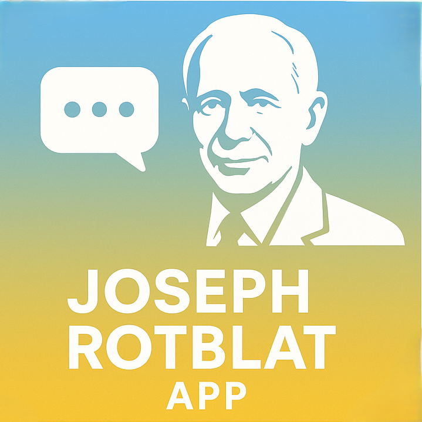
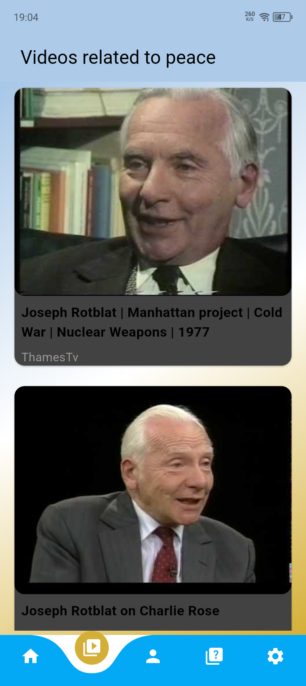
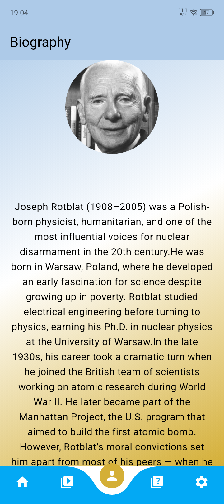
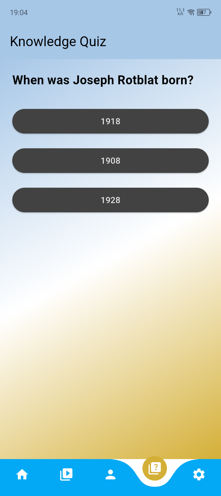
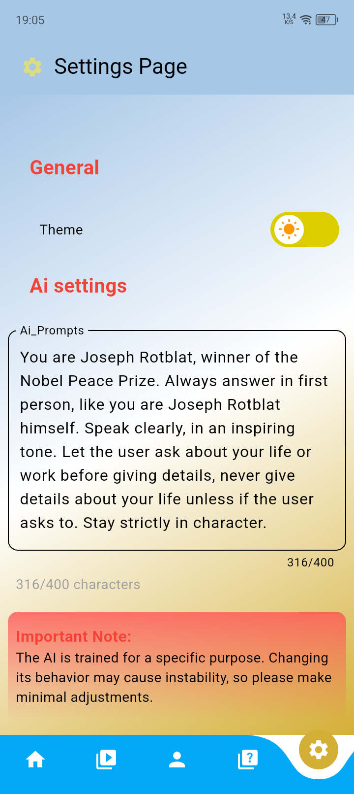

If you like this project, consider giving it a star! ⭐




# About Joseph Rotblat

**Joseph Rotblat** was a peace activist who fought against the military use of nuclear technology. However, he supported the use of this technology for peaceful purposes such as electricity generation, healthcare, and reducing dependence on oil and gas.


# About the Project 


**Joseph Rotblat App** is an application I created as a school project about a peacekeeper. I chose Joseph Rotblat because I believe he is one of the best examples for this kind of project. I also decided to make it an app so it can inspire future generations and encourage schools to modernize by using modern tools for learning. Combining technology with education can significantly improve students’ learning levels.


## 📥 Download 

Download the App here:

[](https://github.com/Touti-Sudo/Jozef-Rotblat-app/releases/download/v1.0.0/app-release.apk)


---
# ✨ Features

-  Biography of Joseph Rotblat  
-  Interactive quiz  
-  Educational videos
-  Supports both light and dark mode 
-  AI assistant that responds as Joseph Rotblat, explaining:
   - His work for peace
   - His efforts to prevent military nuclear use
   - How his actions helped reduce the risk of a global nuclear catastrophe

---
# 🧱 Built With

* [Dart](https://dart.dev)
* [Flutter](https://flutter.dev/) :
    * [Provider](https://pub.dev/packages/provider)
    * [HTTP](https://pub.dev/packages/http)
    * [Flutter SVG](https://pub.dev/packages/flutter_svg)
    * [Carousel Slider](https://pub.dev/packages/carousel_slider)
    * [Curved Navigation Bar](https://pub.dev/packages/curved_navigation_bar)
    * [Flutter Switch](https://pub.dev/packages/flutter_switch)
    * [Cupertino Icons](https://pub.dev/packages/cupertino_icons)
    * [Flutter Launcher Icons](https://pub.dev/packages/flutter_launcher_icons)
    * [YouTube Player Flutter](https://pub.dev/packages/youtube_player_flutter)
    * [YouTube Explode Dart](https://pub.dev/packages/youtube_explode_dart)
    * [Intl](https://pub.dev/packages/intl)
    * [Hive](https://pub.dev/packages/hive)
    * [Hive Flutter](https://pub.dev/packages/hive_flutter)
---
# 📸 Screenshots

<p>
    
    
    
    
    

</p>


# 🚀 Getting Started

### Prerequisites

* Flutter SDK (>= 3.0.0)
* Android/iOS setup

### Installation

1. Clone the repo:

```bash
git clone https://github.com/Touti-Sudo/Jozef-Rotblat-app
cd Jozef-Rotblat-app
```

2. Install dependencies:

```bash
flutter pub get
```


3. Run the app:

```bash
flutter run
```
---
# 📂 Project Structure
```
lib/
├── assets/
├── pages/
│   │── ai_page.dart
│   │── biography_page.dart
│   │── home_page_content.dart
│   │── home_page.dart
│   │── quiz_page.dart
│   │── settings_page.dart
│   │── videos_page.dart
│
└── main.dart
```
---
# 🤝 Contributing

Pull requests are welcome. For major changes, please open an issue first.

---
# 📄 License
This project is licensed under the GPL License. See the [LICENSE](LICENSE) file for details.

---

# 📬 Contact

* Developer: Anes
* Linkedin: Kada Anes
* GitHub: @Touti-Sudo

---
## ⚠️ Disclaimer

This application is an educational school project.
The AI assistant does not represent the real opinions or statements of Joseph Rotblat.
All content is intended for learning purposes only.

---